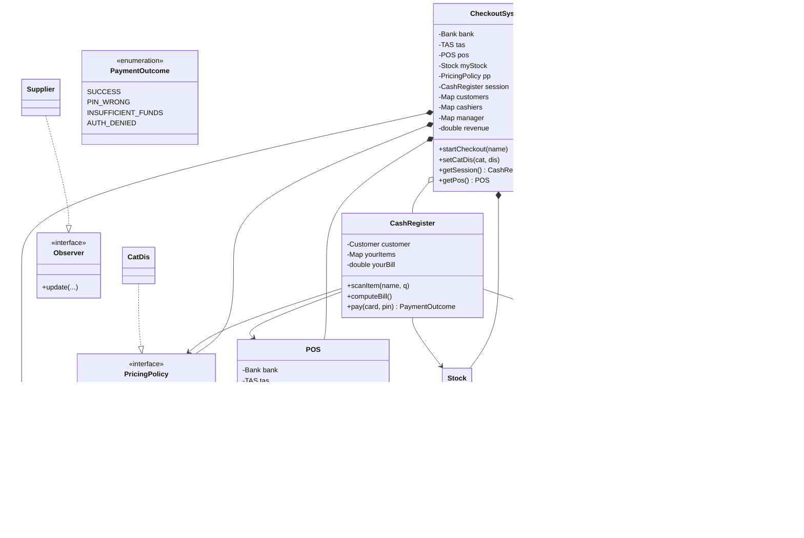

# UML Design Workbook — Supermarket Checkout System

A reference for drawing your UML diagrams. Use it as a checklist while you draw, then share each diagram (or section of one) with me for feedback.

---

## 1. Class inventory

### Coordination layer
- **CheckoutSystem** — long-lived coordinator. Owns Bank, TAS, POS, Stock, PricingPolicy, customer/cashier/manager registries, revenue, current session.
- **CLUI** — command-line UI. Holds reference to CheckoutSystem and `currentUser`.

### Per-session
- **CashRegister** *(consider renaming to CheckoutSession — its lifetime is one customer's checkout)* — holds cart, running bill, customer, refs to Stock/PricingPolicy/POS. Single method `pay() → PaymentOutcome`.

### Inventory
- **Stock** — Map<String, Item>. Implements `Observable`. Notifies observers when an item drops below its threshold.
- **Item** — name, category, price, weight, quantity.

### Payment
- **POS** — Point-of-Sale terminal. Holds refs to Bank, TAS, and a `forcedNext` slot for simulatePayment. Single method `process(card, pin, bill) → PaymentOutcome`.
- **Bank** — holds `card_pin` map (PIN registry). *(Per §2.5, PIN should really live on a Card class — future refactor.)*
- **TAS** — Transaction Authorization System. Holds `card_info` map of `Info` objects.
- **Info** — per-card balance + auth flag.
- **PaymentOutcome** *(enum)* — SUCCESS, PIN_WRONG, INSUFFICIENT_FUNDS, AUTH_DENIED.

### Users (role hierarchy)
- **User** *(abstract)* — username, password.
- **Manager** *(extends User)*.
- **Cashier** *(extends User)*.
- **Customer** *(extends User)* — holds a DiscountPlan reference.

### Discount plans — Strategy pattern (R5/R5b)
- **DiscountPlan** *(interface)* — `billAfterDiscount(double price)`.
- **Prime** — 20% off when subtotal ≥ 50€.
- **Platinum** *(missing)* — 30% off always.
- **Normal** *(missing)* — no discount.

### Pricing policies — Strategy pattern (R6/R6b)
- **PricingPolicy** *(interface)* — `priceAfterDiscount(Item)`.
- **CatDis** — Map<categoryName, multiplier>.

### Observer pattern (R9)
- **Observable** *(interface)* — `notifyObserver(Item)`.
- **Observer** *(interface)* — `update(...)`. *(Signature should pass the Item, not just an int.)*
- **Supplier** *(implements Observer)*.

### Missing / not yet started
- **Card** — should hold cardNumber, PIN per §2.5.
- **Delivery** / **DeliveryStrategy** — R7/R8.
- **TimeSlot**, **Vehicle** — R10.
- **Bill** / **Receipt** — currently a `double`; could be a class.

---

## 2. Relationships

| From | To | Type | Notes |
|---|---|---|---|
| CheckoutSystem | Bank | composition (1) | system owns the bank |
| CheckoutSystem | TAS | composition (1) | |
| CheckoutSystem | POS | composition (1) | |
| CheckoutSystem | Stock | composition (1) | |
| CheckoutSystem | PricingPolicy | composition (1) | the active policy |
| CheckoutSystem | CashRegister | composition (0..1) | the current session, null when idle |
| CheckoutSystem | Customer | aggregation (*) | in `customers` map |
| CheckoutSystem | Cashier | aggregation (*) | in `cashiers` map |
| CheckoutSystem | Manager | aggregation (*) | in `manager` map |
| Stock | Item | composition (*) | items live inside the stock |
| POS | Bank | association | POS asks Bank for PIN |
| POS | TAS | association | POS asks TAS for auth |
| POS | PaymentOutcome | association (0..1) | the forcedNext slot |
| CashRegister | Customer | association | the current customer |
| CashRegister | Stock | association | for sold() updates |
| CashRegister | PricingPolicy | association | |
| CashRegister | POS | association | for pay() |
| CashRegister | Item | aggregation (*) | the cart |
| CLUI | CheckoutSystem | association | |
| CLUI | User | association (0..1) | `currentUser` |
| Customer | DiscountPlan | association | |
| Manager / Cashier / Customer | User | generalization (extends) | |
| Prime / Platinum / Normal | DiscountPlan | realization (implements) | |
| CatDis | PricingPolicy | realization | |
| Stock | Observable | realization | |
| Supplier | Observer | realization | |

**Notation reminder:** composition = filled diamond, aggregation = empty diamond, association = plain line, inheritance = open triangle (extends), realization = dashed line + open triangle (implements).

---

## 3. Design patterns at a glance

| Pattern | Where | Solves |
|---|---|---|
| **Strategy** | DiscountPlan + Prime/Platinum/Normal | R5, R5b — extensible plans |
| **Strategy** | PricingPolicy + CatDis | R6, R6b — extensible pricing rules |
| **Observer** | Observable / Observer / Stock / Supplier | R9 — low-stock notification |
| **Facade** | CheckoutSystem | Hides subsystems from CLUI |
| **Singleton (informal)** | CheckoutSystem, Bank, TAS | One per program (passed by reference, not actual GoF singleton) |

---

## 4. Design decisions to document in the report

- **Discount composition order**: category pricing policy applied first (per item), then customer's plan discount applied to the resulting subtotal. Brief is silent — this is the chosen rule.
- **simulatePayment**: a one-shot `forcedNext` field on POS. The next `process()` call returns it and clears it. Real bank flow is bypassed for that one call only.
- **Card model**: PIN currently in Bank's `card_pin` map. §2.5 says it should be on the card chip — pending refactor (introduce a Card class).
- **Role tracking**: currently an `int` (0/1/2/3) on CLUI. Cleaner alternative: hold `currentUser : User` and check `instanceof Manager / Cashier / Customer`.
- **setup vs my_supermarket.ini**: the ini file is loaded at startup, so the system is preconfigured before any user input. The `setup` CLUI command re-runs the defaults; no login required for it.

---

## 5. Mermaid starter (optional)

If you want to draft in text, here's a partial class diagram. Renders in GitHub, VS Code (with Mermaid plugin), or paste into https://mermaid.live:

---

## 6. Common UML mistakes to avoid

- **Composition vs aggregation**: filled diamond = "I own this, it dies with me" (Stock owns Items; CheckoutSystem owns POS). Empty diamond = "I reference this, but it can outlive me" (CheckoutSystem references registered Customers).
- **Multiplicities on both ends**: every association line should have a `1`, `0..1`, or `*` at each end.
- **Don't show every getter/setter**: include only methods that show behavior, not boilerplate accessors.
- **Static members underlined**: in this design, almost nothing should be static anymore.
- **Interfaces vs classes**: use the `<<interface>>` stereotype and dashed-line realization for implementing.

---

## 7. Diagrams the report needs

1. **Class diagram** — the full picture (this workbook describes its content).
2. **Use case diagram** — actors (Customer, Cashier, Manager, Bank's TAS) and their use cases.
3. **Sequence diagram(s)** — at minimum: the cashier-checkout-and-pay flow. Optionally: the low-stock notification flow, the simulatePayment-then-pay flow.

---

## Workflow for our feedback loop

When you draw a section, share it with me by ONE of these:

1. **Screenshot**: save to this folder (e.g., `class_diagram_draft.png`), tell me to look at it.
2. **Text description**: "I drew CheckoutSystem with these fields and these arrows..."
3. **Mermaid**: paste the source, and I can check the structure exactly.

For each round of feedback, I'll check against:
- This workbook's class inventory and relationships
- Your current code (so the UML matches what's actually there)
- The brief's requirements (so the design covers R1–R10)

Tell me which workflow you want to start with — pen/paper, draw.io, Mermaid, something else?
